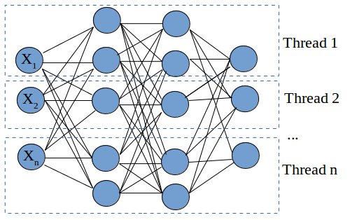

# Binary Neural Network Toolkit

## Training Part
- Python & Chainer

## Inference Part
- C

## Examples
- AlexNet
- Convolutional Neural Networks for Sentence Classification



https://ja.wikipedia.org/wiki/OpenMP

`pi_openMP.cpp`

`g++ -fopenmp -std=gnu++11 pi_openMP.cpp`


```
pi@raspberrypi:~/program $ ./a.out 
OpenMP max threads count = 4
PI ~= 3.14159265458984
Error [%] = 3.18325320541326e-08
Elapsed time [ms] = 13092
pi@raspberrypi:~/program $ ./a.out 
OpenMP max threads count = 4
PI ~= 3.14159265458984
Error [%] = 3.18325461899311e-08
Elapsed time [ms] = 13082
pi@raspberrypi:~/program $ ./a.out 
OpenMP max threads count = 4
PI ~= 3.14159265458984
Error [%] = 3.18325320541326e-08
Elapsed time [ms] = 13060
pi@raspberrypi:~/program $ ./a.out 
OpenMP max threads count = 4
PI ~= 3.14159265458984
Error [%] = 3.18325461899311e-08
Elapsed time [ms] = 13139
pi@raspberrypi:~/program $ ./a.out 
OpenMP max threads count = 4
PI ~= 3.14159265458984
Error [%] = 3.18325461899311e-08
Elapsed time [ms] = 13186
```
4 Cores - 約13秒

COMMENT OUT THIS
`#pragma omp parallel for reduction(+ : sum)`


```
pi@raspberrypi:~/program $ ./a.out 
OpenMP max threads count = 4
PI ~= 3.14159265459007
Error [%] = 3.18398543977992e-08
Elapsed time [ms] = 52032
```


約52秒で完了した。4コアの実行結果のほぼ4倍。
